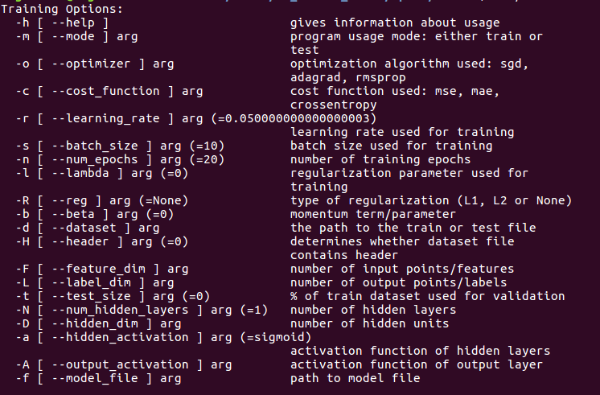

# mLEARn
An Implementation of Mutli-layer Perceptron in C++. 

## Features
### general
* Single-threaded, CPU only
* Reasonably fast
* Simple C++ constructs
* Linux platform currently supported
* Feed-forward networks

### activation functions
* tanh
* sigmoid
* softmax
* rectified linear unit (relu)
* leaky relu
* identity
* exponential linear units(elu)

### cost functions
* cross-entropy
* mean squared error (MSE)
* mean absolute error (MAE)

### optimization algorithms
* mini-batch stochastic gradient descent (SGD)
* adagrad
* rmsprop

### miscellenous
* L1/L2 regularization
* Momentum

## Building from Source
### dependencies
* C++11 compiler
* Boost (program_options, unit_test_framework, serialization, ublas)
* CMake (tested with version 3.5.1 )

### binaries and static libraries
The following will build static libraries and binaries. The binaries and libraries are located in the bin and lib directories respectively.
```bash
$ mkdir -p build
$ cd build
$ cmake  ..
$ make 
```
## Running the mlearn Program
The executables (mlearn and unit_test) will reside in bin/. You can run from the project directory or put the binaries in /usr/local/bin/ or execution path. Note that the programs look for the MNIST dataset in the data/ directory. So the data/ directory should be in your run directory, if you want to run unit test or train/test with MNIST.

### data format
Each row of sample should be concatenation of features and labels using comma as the delimiter. The file may contain a header. Sample dataset for xor and MNIST can be found in the data/ directory. The following is a header-less xor data file, of feature and label dimensions 2 and 1 respectively. The delimiter is a comma (the last column represents the labels).
```
1,0,1
0,1,1
0,0,0
1,1,0
1,0,1
0,1,1
0,0,0
1,1,0
1,0,1
0,1,1
0,0,0
1,1,0
```
In order to know  the parameters and usage:
```bash
$ bin/mlearn -h 
$ bin/mlearn --help
```

### example 1: regression
This example illustrates solving a regression probplem with MLP. The train and test datasets are "oilTrn.dat" and "oilTst.dat" located in the data/ directory. These are slightly modified version of those included with Netlab(cite). There are 500 samples in each of the dataset. Each sample consists of 14 vlaues delimited by commas (feature and label dimensions are 12 and 2 respectively). The following trains a model with the following parameters:
```
mode : train
optimizer: sgd
cost_function: mse
dataset: data/oilTrn.dat
hidde_dim: 10
output_activation: sigmoid
num_epochs: 30
model_file: oil_model.bin
feature_dim: 12
label_dim: 2
```
```bash
bin/mlearn -m train -o sgd -c mse -d data/oilTrn.dat  -D 10 -A sigmoid -n 30  -f oil_model.bin -F 12 -L 2
```
Deafault parameters are used for any missing option. Adding regularization and momentum to the model:
```
reg: L2
lambda: 0.05
beta: 0.05
```
```bash
bin/mlearn -m train -o sgd -c mse -d data/oilTrn.dat  -D 10 -A sigmoid -n 30  -f oil_model.bin -F 12 -L 2 -R L2 -l 0.05 -b 0.05
```
The following parameters must be specified to test the model:
```
mode : test
cost_function: mse
dataset: data/oilTst.dat
model_file: oil_model.bin
feature_dim: 12
label_dim: 2
```
And the following is used to test the model "oil_model.bin" on data/oilTst.dat:
```bash
 bin/mlearn -m test  -d data/oilTst.dat  -f oil_model.bin -F 12 -L 2 -c mse
```

