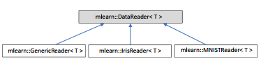
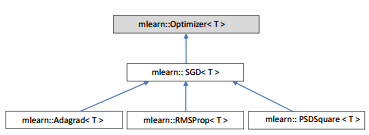

# Abstract

This paper presents ``mLEARn``, an open-source implementation of multi-layer perceptron
in C++. The techniques and algorithms implemented represent existing approaches in
machine learning. ``mLEARn`` is written using simple C++ constructs. The aim of ``mLEARn``
is to provide a simple and extendable machine learning platform for students in courses
involving C++ and machine learning. The source code and documentation can
be downloaded from https://github.com/kalu-o/mLEARn.

# Introduction

Artificial neural networks (ANNs) comprise a well-studied area of deep learning.
This is because of their importance in many areas, from autonomous driving through speech
technologies [@Graves:2013]. The two main categories are usually recurrent (feedback)
and feed-forward architectures [@Bishop:1995]. Deep learning is currently an active research area in machine learning.

# Statement of Need

Currently, popular deep learning frameworks are available, such as MXNet [@mxnet], Caffe [@caffe] and TensorFlow [@tensorflow]. Students often use these as off-the-shelf machine learning tools and have little or no control over the implementation. One of the reasons for 
this is because the codes are advanced and production ready. ``mLEARn`` addresses this and it can be used as an off-the-shelf machine learning tool. Furthermore, the coding style makes it easier to apply what was learnt in machine learning/C++ courses and extend the functionalities. This makes it easier to understand machine learning algorithms from first principles and extend the state-of-the-art.

# Architecture of mLEARn

The classes implemented in ``mLEARn`` are Node, NetNode, Activation, CostFunction, Layer,
Network, DataReader and Optimizer. The Node class is the fundamental data structure
used; and NetNode is an extension of the Node class used for multi-layer perceptron. The Activation class handles activation functions in the network. Currently, the functions implemented are sigmoid, tanh, rectified linear unit (ReLU), leaky ReLU, identity, softmax
and exponential linear unit (ELU). The CostFunction class is responsible for objective/loss functions. Cost functions implemented are mean squared error (MSE), mean absolute error (MAE) and cross entropy.

      
*Figure 1: The Node class*

  
*Figure 2: The CostFunction class*

The Network class is a classic MLP consisting of sequences of layers, i.e., one or more
hidden layers and an output layer. The DataReader class is the base class responsible for
reading train/test datasets into features and labels. Three different readers are implemented,
namely MNISTReader, GenericReader and IrisReader. The Optimizer class is the base class responsible
for the training algorithms. Three optimizers are currently implemented: mini-batch stochastic gradient descent [@Kiefer:1952; @Ruder16], adaptive gradient (Adagrad) [@Duchi:2011] and root mean square propagation (RMSProp) [@Tieleman:2012].

   
*Figure 3: The DataReader class*

    
*Figure 4: The Optimizer class*

A number of new enhancements such as automatic differentiation, distributed computing and GPU support are planned to be added in the future.

# Use in Teaching and Learning Context

The following describes some use cases in the context of teaching and learning, as example assigned student tasks.

1. Read a custom data set

This will involve extending the DataReader class in data_reader.cpp to read a custom data set. The learning objective is to enable students to extend the functionalities of a base class.

2. Activation functions

At the end of this exercise, students are expected to implement common activation functions and their derivatives. A number of activation functions such as Sigmoid, Tanh, etc. are already provided. Possible course assignments include:
* Removing the implementations of these functions and asking students, for example, to implement the Sigmoid function and its derivative.
* Extending with a novel activation function.

3. Understanding basic learning algorithms (back-propagation)

The back-propagation algorithm is a basic machine learning algorithm often taught in foundation courses in deep learning. Students should be able to Implement the forward and backward pass. These are already implemented in the Layer class.

4. Advanced deep Learning algorithms (RMS-Prop, Adagrad, etc.)

Adaptive learning algorithms are an active research area in deep learning. The Optimizer class provided contains an implementation of RMS-Prop and Adagrad. These implementations
could be removed and students asked to implement these learning algorithms. Furthermore, others such as Adams, Adadelta, etc., are not implemented yet. Their implementation is a good exercise that will demonstrate grounding in adaptive learning algorithms.

5. Extending the architecture of the network (advanced)

The current implementation of the architecture needs improvement. One such area is refactoring the 'Layer' class into a base class and deriving sigmoid, tanh, relu and convolution layers from this.

# Acknowledgements

The core work in neural networks and convergence was done as part of the DEA thesis "Training Multi-layer Perceptron using Genetic Algorithms", while the author was with GRLMC at Rovira i Virgili University, Tarragona. The author would
like to acknowledge support for the speech and language technologies program.

# References

